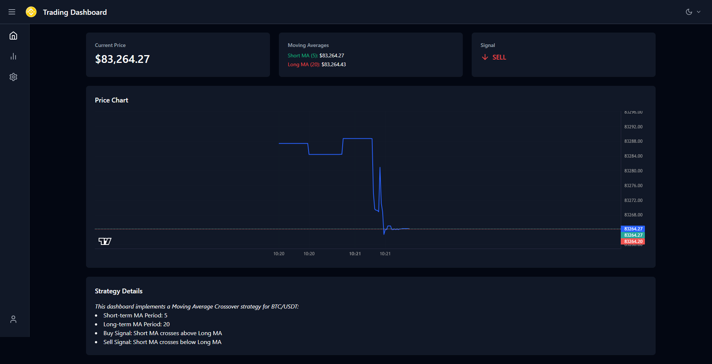
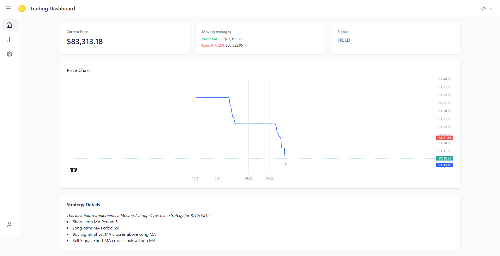

# Trading Dashboard

A modern and responsive trading dashboard built with **React**, **TypeScript**, and **Tailwind CSS**. This application provides real-time trading data visualization, including price charts, moving averages, and trading signals.

---

## Features

- **Real-Time Price Chart**: Visualize trading data with a responsive and interactive chart powered by `lightweight-charts`.
- **Moving Averages**: Display short-term and long-term moving averages for better trend analysis.
- **Trading Signals**: Highlight buy/sell signals based on predefined strategies.
- **Dark Mode**: Seamless dark and light mode support for better user experience.
- **Responsive Design**: Optimized for all screen sizes, from mobile to desktop.

---

## Technologies Used

- **React**: A JavaScript library for building user interfaces.
- **TypeScript**: Adds static typing to JavaScript for better code quality.
- **Tailwind CSS**: A utility-first CSS framework for rapid UI development.
- **Lightweight Charts**: A lightweight and fast library for financial charts.
- **Vite**: A fast build tool for modern web applications.

---

## Installation

1. Clone the repository:
   ```bash
   git clone https://github.com/gauravmehra13/tradingDashboard
   ```
2. Navigate to the project directory:
   ```bash
   cd trading-dashboard
   ```
3. Install dependencies:
   ```bash
   npm install
   ```
4. Start the development server:
   ```bash
   npm run dev
   ```
5. Open your browser and visit `http://localhost:5173` to view the application.

---

## Usage

### Dashboard

- The dashboard displays the current price, moving averages, and trading signals.
- Use the chart to analyze price trends and trading patterns.

### Dark Mode

- Toggle between dark and light mode using the theme toggle in the navbar.

---

## Contributing

Contributions are welcome! If you'd like to contribute, please follow these steps:

1. Fork the repository.
2. Create a new branch (`git checkout -b feature/YourFeatureName`).
3. Commit your changes (`git commit -m 'Add some feature'`).
4. Push to the branch (`git push origin feature/YourFeatureName`).
5. Open a pull request.

---

## License

This project is licensed under the MIT License. See the [LICENSE](LICENSE) file for details.

---

## Acknowledgments

- [Lightweight Charts](https://github.com/tradingview/lightweight-charts) for the financial charting library.
- [Tailwind CSS](https://tailwindcss.com/) for the utility-first CSS framework.
- [Vite](https://vitejs.dev/) for the fast build tool.

---

## Screenshots

<!-- Add screenshots here if available -->




---

## Contact

For questions or feedback, feel free to reach out:

- **Email**: gauravmehra2470@.com
- **GitHub**: [gauravmehra13](https://github.com/gauravmehra13)
